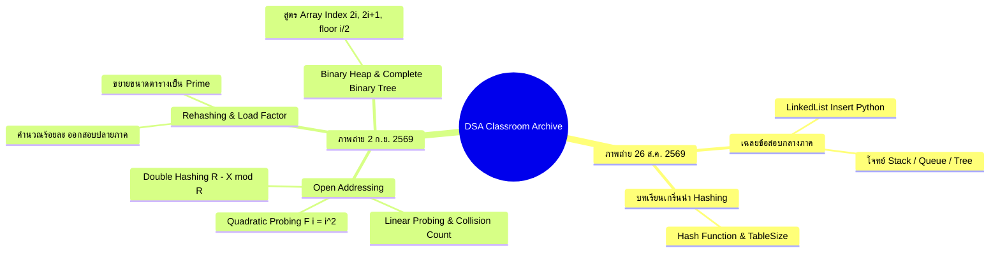

# คลังภาพถ่ายห้องเรียนและแนวข้อสอบวิชา Data Structures & Algorithms (Exam Prep & Classroom Archive)

เอกสารนี้รวบรวมและวิเคราะห์เนื้อหาจาก **ภาพถ่ายสไลด์ในห้องเรียน 60 ภาพ (`DSA-pic/`)** ควบคู่กับ **การถอดเทปเสียงคำบรรยายฉบับจริง (`20260902_*.aac`)** ของ **อาจารย์ประดิษฐ์ พิทักษ์เสถียรกุล** เพื่อเตรียมความพร้อมสำหรับข้อสอบกลางภาคและปลายภาค

---

## 📸 สารบัญการจำแนกภาพถ่ายและไฟล์เสียง (Media Inventory)



---

## 📝 ส่วนที่ 1: เฉลยข้อสอบกลางภาค (Midterm Exam Solutions Analysis)
*(อ้างอิงจากภาพ `Screenshot_20260826-122139.jpg`, `IMG_20260826_091737_*.jpg`)*

### ข้อที่ 1.1: การเขียนคำสั่ง Python จัดการ Linked List (5 คะแนน)

> [!NOTE] โจทย์ข้อสอบกลางภาค (Exam Problem 1.1)
> **โจทย์:** If there is an existing LinkedList's instance variable `listA` which has two elements `5, 2` already. Write statements in main program to insert the ordered inputs `1, 3, 8, 7, 9` into `listA` so that the resulting output is `9, 5, 1, 3, 7, 2, 8`. Use only the LinkedList methods learned in class. `// Score 5`

#### ลำดับการแทรกข้อมูลทีละขั้นตอน (Step-by-Step Trace)
- สถานะเริ่มต้น: `listA` = `[5, 2]` (Index 0: 5, Index 1: 2)
- เป้าหมายปลายทาง: `[9, 5, 1, 3, 7, 2, 8]`

```python
# สถานะเริ่มต้น: listA = [5, 2]

# 1. แทรกเลข 1 เข้าที่ Index 1
listA.insert(1, 1)  
# ผลลัพธ์: [5, 1, 2]

# 2. แทรกเลข 3 เข้าที่ Index 2
listA.insert(2, 3)  
# ผลลัพธ์: [5, 1, 3, 2]

# 3. แทรกเลข 8 เข้าที่ตำแหน่งท้ายสุด (Index 4)
listA.insert(4, 8)  
# ผลลัพธ์: [5, 1, 3, 2, 8]

# 4. แทรกเลข 7 เข้าที่หน้าเลข 8 (Index 4)
listA.insert(4, 7)  
# ผลลัพธ์: [5, 1, 3, 7, 2, 8]

# 5. แทรกเลข 9 เข้าที่หน้าสุด (Index 0)
listA.insert(0, 9)  
# ผลลัพธ์: [9, 5, 1, 3, 7, 2, 8]  <-- ตรงตามเป้าหมายสมบูรณ์
```

> [!WARNING] ข้อควรระวังในห้องสอบ
> - ต้องใช้เฉพาะ method ของ Linked List ที่เรียนในห้อง (เช่น `insert(index, value)`)
> - ห้ามใช้ Built-in method อื่นที่ไม่ได้สอน เช่น sort()
> - ต้องระวัง index เลื่อนหลังจากแทรกตัวก่อนหน้า

---

## 🎯 ส่วนที่ 2: จุดเน้นและคำเตือนออกสอบเรื่อง Hashing
*(อ้างอิงจากเทปเสียง 2 ก.ย. 2569 และภาพถ่าย `IMG_20260902_*.jpg`)*

### 1. การนับจำนวนครั้งที่ชน (Collision Count Trap)

```
เมื่อใส่ข้อมูลครบ 5 ตัวแล้ว มีการชนกันและแก้การชนกัน รวมทั้งสิ้นกี่ครั้ง?
```

- **ข้อมูลที่ใส่:** 5 ตัว
- **ข้อมูลการชน:**
  - ตัวที่ 1 (เช่น 69): ชนและแก้ 3 ครั้ง
  - ตัวที่ 2 (เช่น 58): ชนและแก้ 3 ครั้ง
  - ตัวที่ 3 (เช่น 49): ชนและแก้ 1 ครั้ง
- **คำตอบที่ถูกต้อง:** $3 + 3 + 1 =$ **7 ครั้ง**
- ❌ **คำตอบที่ผิด (ได้ 0 คะแนน):** ห้ามตอบ 14 ครั้งเด็ดขาด! (นักศึกษาบางคนคิดว่าชน 7 แก้ 7 รวม 14 อาจารย์ย้ำว่าถ้าตอบ 14 จะได้ 0 ทันที)

---

### 2. นิยาม Wrap Around ใน Hashing
- **คำนิยาม:** *"When the key was mapped to the last index of hash table, it go back to the first index of hash table by mod tablesize one more time."*
- **กลไก:** เมื่อ Probe ไปจนสุดปลายตาราง ให้วนกลับมาตำแหน่งที่ 0 โดยการนำตำแหน่งใหม่ไป **$\bmod \text{TableSize}$ ซ้ำอีกรอบ**

---

### 3. Double Hashing & ค่าคงที่ $R$ (ข้อสอบจะไม่ใช้ TableSize = 10)
- ฟังก์ชันแฮชที่สอง:
  $$\text{hash}_2(X) = R - (X \bmod R)$$
- **กฎเหล็กของค่า $R$:**
  1. $R$ เป็น **จำนวนเฉพาะ (Prime Number)**
  2. $R$ ต้อง **น้อยกว่า TableSize** ($R < \text{TableSize}$)
  3. $R$ ต้องเป็นจำนวนเฉพาะที่มีค่า **มากที่สุดที่ยังน้อยกว่า TableSize**
- **ตัวอย่างกรณีในข้อสอบ:**
  - ถ้า TableSize = 10 $\rightarrow R = 7$
  - ถ้า TableSize = 13 $\rightarrow R = 11$
  - ถ้า TableSize = 16 $\rightarrow R = 13$
  - ถ้า TableSize = 17 $\rightarrow R = 13$

---

### 4. Load Factor ($\lambda$) และ Rehashing (อาจารย์ย้ำ "สอบปลายภาคมีนะ!")
- **สูตรการคำนวณ Load Factor:**
  $$\lambda = \frac{N \times 100}{\text{TableSize}} \%$$
- **เกณฑ์การทำ Rehashing:**
  - เมื่อ $\lambda > 0.5$ (หรือบางกรณี $> 70\%$)
- **กฎการเลือกขนาดตารางใหม่ (New TableSize):**
  - ขนาดใหม่ต้องเป็นอย่างน้อย 2 เท่าของเดิม ($2 \times \text{TableSize}$)
  - **ต้องเลือกจำนวนเฉพาะตัวแรกที่มากกว่า $2 \times \text{TableSize}$**
  - *ตัวอย่างห้องเรียน:* ตารางเดิมมี 7 ช่อง $\rightarrow 7 \times 2 = 14 \rightarrow$ จำนวนเฉพาะถัดไปคือ **17** (ไม่ใช่ 13, 14, 15, หรือ 16)

---

## 🌲 ส่วนที่ 3: Binary Heap & Complete Binary Tree
*(อ้างอิงจากภาพ `IMG_20260902_113705_*.jpg` และเทปเสียง 11:37 น.)*

### สูตรการแปลง Complete Binary Tree เป็น Array

> [!IMPORTANT] เงื่อนไขชี้เป็นชี้ตาย
> **Root ต้องอยู่ที่ Index 1 ใน Array เสมอ!** ห้ามเริ่มต้นที่ Index 0 เพราะจะทำให้สูตรคำนวณพังทั้งหมด

```
            [ 1: Root ]
           /           \
      [ 2: Left ]   [ 3: Right ]
      /         \
 [ 4: Left ] [ 5: Right ]
```

| ความสัมพันธ์ | สูตรคำนวณ | ข้อกำหนดพิเศษ |
| :--- | :--- | :--- |
| **Left Child** | $2i$ | หาตำแหน่งลูกซ้าย |
| **Right Child** | $2i + 1$ | หาตำแหน่งลูกขวา |
| **Parent** | $\lfloor i / 2 \rfloor$ | **ตัดเศษทิ้งเสมอ (Truncate)** ห้ามปัดขึ้น! เช่น $\lfloor 7 / 2 \rfloor = 3$ |

---

## 💻 ส่วนที่ 4: การไล่โค้ด BinaryHeap และแนวข้อสอบปลายภาค
*(อ้างอิงจากเทปเสียง 9 ก.ย. 2569: `dsa20260909_092303.aac` และ `20260909_103704.aac`)*

### 1. โค้ดคลาส `BinaryHeap` (Min-Heap ในภาษา Python)
- อาเรย์เก็บข้อมูลเริ่มต้นที่ Index 1 (`self.heapList = [0]`)
- **การแทรกข้อมูล (`insert`):**
  - นำข้อมูลใหม่ต่อท้ายสุด (`self.heapList.append(k)`) แล้วเรียก `self.percUp(self.currentSize)`
  - **Percolate Up:** วนลูปเปรียบเทียบกับพ่อ ($i // 2$) หากลูกมีค่าน้อยกว่าพ่อ ให้สลับที่ (Swap) ขึ้นไปเรื่อยๆ จนกว่าจะถูกตำแหน่ง
- **การลบค่าต่ำสุด (`deleteMin`):**
  - นำ Root (Index 1) ออกไป ซึ่งเป็นค่าต่ำสุด
  - นำโหนดตัวสุดท้ายของ Heap มาวางแทนที่ Root ชั่วคราว แล้วลดขนาด (`self.currentSize -= 1`)
  - เรียก `self.percDown(1)` ดันค่านั้นลงไปตามตำแหน่งที่ถูกต้อง
  - **Percolate Down:** หา Child ตัวที่เล็กที่สุดระหว่างลูกซ้าย ($2i$) กับลูกขวา ($2i+1$) แล้ว Swap กับลูกที่เล็กกว่า วนลูปจนกว่าคุณสมบัติ Min-Heap จะสมบูรณ์

### 2. 🎯 ข้อสอบปลายภาคที่อาจารย์แง้มในคลาส (Final Exam Leaks)
1. **ข้อสอบโจทย์ DeleteMin 3 รอบติด:**
   - ในข้อสอบปลายภาค อาจารย์แง้มว่าจะให้รูป Heap หรือตาราง Array เริ่มต้นมา แล้วสั่งให้ทำ **DeleteMin ติดต่อกัน 3 ครั้ง**
   - นักศึกษาต้องวาดสถานะของ Tree หรือเขียนค่าในตาราง Array หลังทำ DeleteMin แต่ละรอบให้ถูกต้อง
   - ต้องบริหารเวลาให้ทำเสร็จภายใน 5-10 นาทีต่อข้อ
2. **ข้อสอบคำนวณจำนวนโหนด Complete Binary Tree (ข้อสอบข้อใหญ่ข้อที่ 2):**
   - คำถาม: *"How many minimum/maximum number of nodes of complete binary tree at the height 10?"*
   - โหนดน้อยสุด: $2^H = 2^{10} = \mathbf{1,024 \text{ โหนด}}$
   - โหนดมากสุด: $2^{H+1} - 1 = 2^{11} - 1 = \mathbf{2,047 \text{ โหนด}}$
   - **⚠️ กฎสำคัญ:** ต้องตอบเป็นตัวเลขจริง 1024 และ 2047 ห้ามตอบติดรูปเลขยกกำลัง ไม่เช่นนั้นได้ 0 คะแนน!
3. **การบ้านในคาบ 9 ก.ย.:** สั่งให้ทำ DeleteMin 1 ครั้ง และแปลงค่าลงในช่อง Array ส่งผ่าน Google Classroom ก่อนเวลา 12.00 น.

---

## 🔗 หน้าที่เกี่ยวข้อง
- [[Lecture-7-Hashing|Lecture 7: Hashing & Collision Resolution]]
- [[Lecture-8-Priority-Queue|Lecture 8: Priority Queue & Heap Structure]]
- [[Assignment-3-Binary-Heap|Assignment 3: Binary Heap Implementation]]
