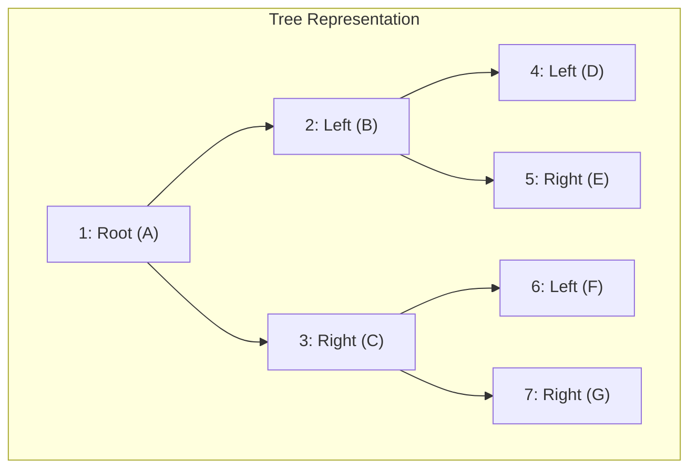

# Source: Lecture 8 Priority Queue (Heap)

## Summary
Introduction to Priority Queues and their implementation using Binary Heaps.

## Key Takeaways
- **Priority Queue**: Supports `insert` and `deleteMin`. Unlike regular queues, items are processed based on priority.
- **Binary Heap**: A complete binary tree that satisfies the heap-order property.
- **Heap-Order Property**: For every node $X$, the key in its parent is $\le$ the key in $X$. The root is always the minimum.
- **Array Representation**: Because it's a complete tree, it maps perfectly to an array:
    - Left child of $i$ is $2i$.
    - Right child of $i$ is $2i + 1$.
    - Parent of $i$ is $\lfloor i / 2 \rfloor$ (ตัดเศษทิ้ง เช่น $7/2 = 3.5 \rightarrow 3$).

### 3. เจาะลึกคำเตือนและแนวข้อสอบจากผู้สอน (Lecturer Insights & Exam Traps by อ.ประดิษฐ์)
จากการบรรยายในห้องเรียนและถอดเทปเสียง (Lecture Voice Archive: 2026-09-02):

> [!WARNING] จุดดักคะแนนสอบ 1: ตำแหน่ง Index ใน Array (Root อยู่ที่ 1 เสมอ!)
> - **คำเตือนจากอาจารย์:** "สมการนี้จะใช้ได้ก็ต่อเมื่อ Root อยู่ใน Array ตำแหน่งที่ 1 ไม่ใช่ตำแหน่งที่ 0! ถ้าเริ่มต้นที่ตำแหน่ง 0 สมการนี้จะใช้ไม่ได้เลย! ในการสอบและการเขียนโค้ด ให้จองขนาด Array เป็น `capacity + 1` และเว้น index 0 ไว้เสมอ"

> [!INFO] จุดดักคะแนนสอบ 2: การคำนวณ Parent และการตัดเศษทิ้ง (Truncation)
> - สูตรการหา Parent: $\text{Parent}(i) = \lfloor i / 2 \rfloor$
> - **ข้อควรระวังในห้องสอบ:** "เวลาเราคำนวณหา Parent ถ้ามันมีเศษ **ให้ตัดเศษทิ้ง!** เอาแต่เลขจำนวนเต็มมาใช้ เพราะตำแหน่ง Index เป็นเลขจำนวนเต็ม ไม่มีทศนิยม เช่น ตำแหน่งที่ 7 $\rightarrow 7/2 = 3.5 \rightarrow$ ตัด .5 ทิ้งเหลือ 3 ดังนั้น Parent คือโหนดที่ตำแหน่ง 3 (ไม่ใช่การปัดเศษขึ้น!)"



| Property | Formula | ตัวอย่างที่ $i=3$ (Node C) | ตัวอย่างที่ $i=7$ (Node G) |
| :--- | :--- | :--- | :--- |
| **Left Child** | $2i$ | $2 \times 3 = 6$ (Node F) | - |
| **Right Child** | $2i + 1$ | $2 \times 3 + 1 = 7$ (Node G) | - |
| **Parent** | $\lfloor i/2 \rfloor$ | $\lfloor 3/2 \rfloor = 1$ (Node A) | $\lfloor 7/2 \rfloor = 3$ (Node C) *(ตัด .5 ทิ้ง)* |

## Related Concepts
- [[heap-priority-queue]]
- [[Exam-Preparation-and-Classroom-Review|ข้อสอบและสรุปแนวข้อสอบจากห้องเรียน (Exam Prep)]]

## Detailed Raw Source Integration

ส่วนนี้เติมจาก raw material ใน `raw/Data structure` เพื่อให้ source page นี้เป็นหน้าใช้งานจริงตามหลัก LLM Wiki: อ่านแล้วรู้ที่มา, เห็น implementation logic, และโยงกลับไปตรวจต้นฉบับได้ทันที.

### Source Coverage Added
- [[raw/Data structure/ปี67/Lecture 8 Priority Queue (Heap)/Lecture 8 Priority Queue (Heap).pdf|Lecture 8 Priority Queue (Heap).pdf]] (10 pages, 2125 extracted characters) -> `conductor/extracted/ปี67_Lecture_8_Priority_Queue_Heap_Lecture_8_Priority_Queue_Heap_.pdf.txt`
- [[raw/Data structure/สำเนาของ  8.pdf|สำเนาของ  8.pdf]] visual source

### Deep Notes
- Priority Queue is an ADT where removal returns the item with highest or lowest priority rather than the oldest/newest item.
- The lecture uses binary heap as the practical implementation: complete binary tree shape stored in an array. For min-heap, every parent is <= its children.
- Array indexing gives parent/child navigation without node pointers. With 1-based indexing: parent i/2, left child 2i, right child 2i+1. With 0-based indexing: parent (i-1)//2, children 2i+1 and 2i+2.
- Main trade-off: `findMin` is O(1), insert/deleteMin are O(log n), and the complete-tree shape keeps memory compact.

### Visual Source Checklist
- ![[raw/Data structure/สำเนาของ  8.pdf|180]]

### Raw Extracted Text
Page markers are preserved from the extraction layer so the notes can be checked against the original PDF page-by-page.

#### Extract: `conductor/extracted/ปี67_Lecture_8_Priority_Queue_Heap_Lecture_8_Priority_Queue_Heap_.pdf.txt`
```text
--- PAGE 1 ---
DATA STRUCTURES 
AND
ALGORITHMS
Lecture Notes 8
Pradit Pitaksathienkul

--- PAGE 2 ---
2
ROAD MAP
PRIORITY QUEUES (HEAPS)
Model
Simple Implementations
Binary Heap

--- PAGE 3 ---
3
Model
Priority Queue is a data structure that 
allows at least two operations
insert
equivalent to enqueue operation in queue ADT
deleteMin
finds, returns and removes the minimum 
element in priority queue
equivalent to dequeue operation in queue ADT

--- PAGE 4 ---
4
Model

--- PAGE 5 ---
5
Model
Many applications
Printer queues
Multiuser O/S process scheduling
Many graph algorithms

--- PAGE 6 ---
6
Heap Structures
Binary Heap : we learn this one.
d-Heap
Leftist Heap
Binomial Heap
Fibonacci Heap
Binary heap is very common !
We will refer to binary heaps as “heaps”
Heaps have 2 properties คุณสมบัติ
Structure property คุณสมบัติเชิงโครงสร้าง
Heap-Order property คุณสมบัติเชิงอันดับ

--- PAGE 7 ---
7
Structure Property of Heaps 
Binary heap is a complete 
binary tree
completely filled except the 
bottom level which is filled 
from left to right
if heap has height h then 
number of nodes is 
between 2h and 2h+1 -1
height of a heap with N 
nodes is O(logN)
complete binary tree
it is a regular structure so can be 
represented in an array !

--- PAGE 8 ---
8
Structure Property of Heaps
Array implementation of complete binary tree
For an element in position i
2i
is the left child
2i+1 is the right child
i/2
is the parent
ตัดเศษทิง 7/2 = 3
Python use //
Map tree to array 
implementation

--- PAGE 9 ---
9
Heap-Order Property
For each node X, key in the parent is smaller than the 
key in X (except the root)
Minimum element can always be found at the root
Only left tree is a heap !

--- PAGE 10 ---
10
class BinaryHeap:
def __init__(self, capacity=100):
# สร้าง list ที มีขนาด capacity + 1 ( index 0 ไม่ถูกใช้งาน)
self.array = [None] * (capacity + 1)
self.currentSize = 0
def is_empty(self):
return self.currentSize == 0
def is_full(self):
return self.currentSize == len(self.array) – 1
def find_min(self):
if self.is_empty():
print("Queue is empty")
return None
return self.array[1]
```
